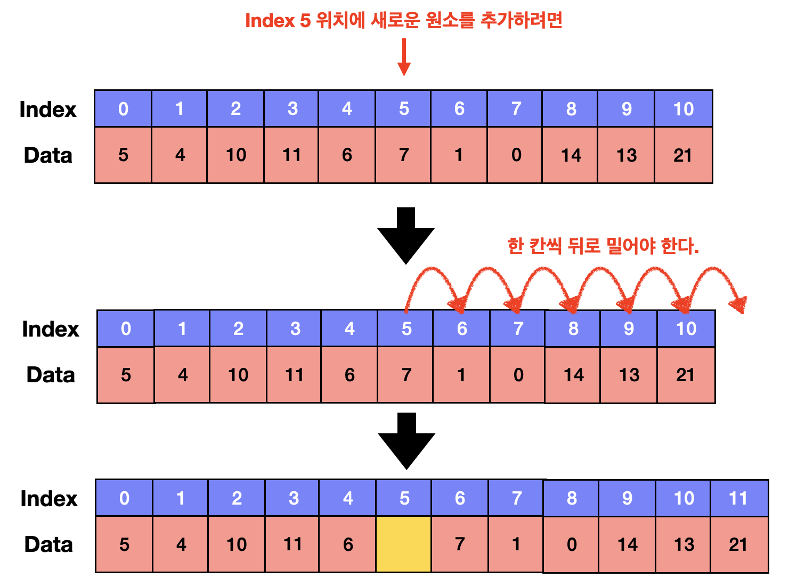
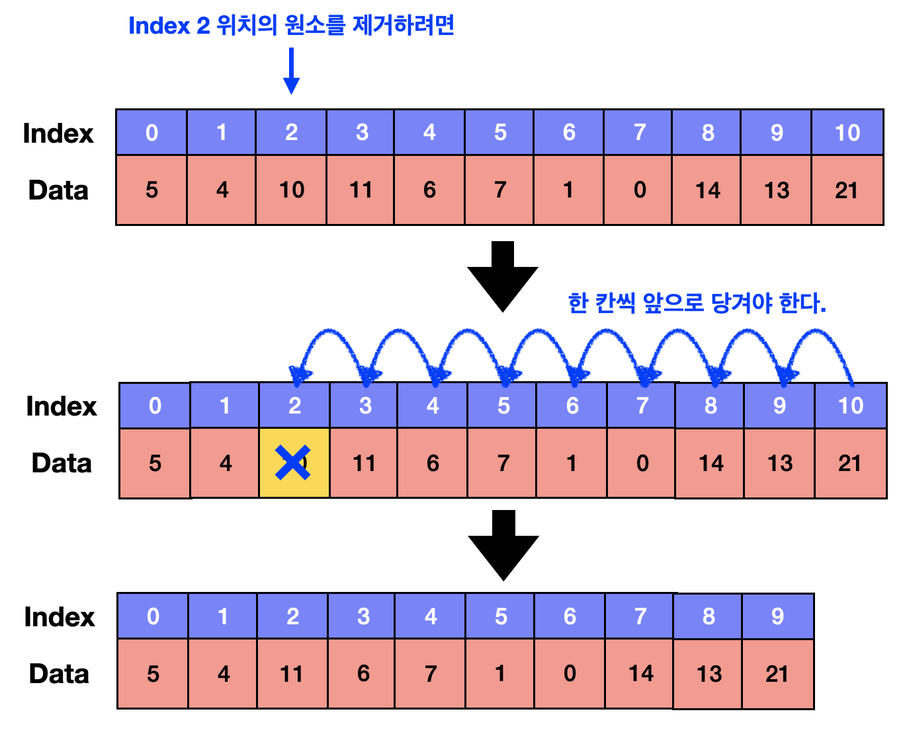
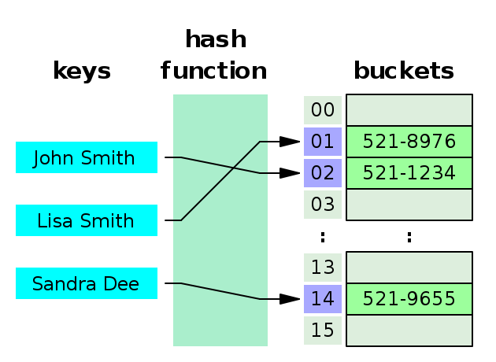

# Data Structure -1

- [Array vs Linked List](#Array_vs_Linked_List)
- [HashTable](#HashTable)

***************************************

## Array vs Linked List

### Array

가장 기본적인 자료구조에 속하며, **연속된 메모리 공간**에 순차적으로 데이터를 저장하는 선형 자료구조이다.
배열의 가장 큰 특징으로는 `색인(index)`으로 해당 원소(element)를 접근할 수 있다는 점과 논리적 저장 순서와 물리적(메모리) 저장 순서가 일치한다.

접근할 때의 시간 복잡도는 `Big-O(1)`에 해당 하며 즉,비순차접근(Random Access)가 가능하다는 장점이 존재한다.

- 배열의 맨 뒤 데이터를 삽입 또는 삭제하는 경우 : O(1)

**배열의 끝 주소 = 시작주소 + (1칸이 차지하는 주소 X 배열 길이)**

위 수식을 통해 배열의 끝 주소를 찾고, 배열의 길이를 1 증가시킨 후, 추가할 원소 데이터를 저장하면 된다.

그러므로 시간복잡도는 O(1)이다. 

- 배열의 맨 뒤를 제외한 경우의 위치에 데이터를 삽입 / 삭제 하는 경우 : O(N)

정확히 임의의 위치에 원소를 새로 추가하기 위해 `Big-O(1)`가 소요되지만 요소의 개수를 N개로 가정하였을 때 통상적으로 Big-O(N)으로 표기한다.

정확히 중간에 삽입 또는 삭제하는 경우에도 N/2로 가정하여 O(N)으로 간주된다.

유의할 점으로는 만약 배열의 원소 중 어느 원소를 삭제했다고 했을 때, 배열의 연속적인 특징이 깨지게 된다.
배열의 빈공간이 생겨 특성이 깨지게된다. 따라서 삭제한 원소보다 큰 인덱스를 가지는 원소들을 `shift`해줘야하는 비용이 발생한다.

이 경우에는 시간복잡도가 Big-O(n)에 해당된다. 그렇기 때문에 배열에서의 삭제기능에서 worst case 시간복잡도는 O(n)이 된다.

삽입의 경우도 만약 첫번째 자리에 새로운 원소를 추가하고자 한다면 모든 원소들의 인덱스를 1 씩 shift 해줘야 하므로 이 경우도 O(n)의 시간을 요구하게 된다.

### Linked List
해당 문제점을 해결하기 위해 고안된 자료구조가 연결리스트라고 불리는 Linked List이다. 각각의 원소들은 자기 자신 다음에 어떤 원소인지만을 기억하고 있다.
즉, 하나의 노드가 다음 노드를 기억하고 있기에 삽입 또는 삭제 작업을 할경우 시간복잡도는 `Big-O(1)`이다

하지만, Linked List의 고질적인 문제점으로 지적되는 원하는 위치의 삽입 작업을 하기위해 첫 요소부터 Search 작업을 수행하게 된다.
Array와는 달리 논리적 저장 순서와 물리적 저장순서의 차이가 존재하기 때문이다.

만약 길이가 5인 List의 3번째 요소 중간에 새로운 요소를 삽입할 경우 삽입후 원래 요소의 순서와 비교하며 새롭게 정렬을 시도하기 때문에, 새로운 삽입은
결국 삽입 후 정렬이 일어나게되고 삭제 또한 마찬가지기에 추가적으로 시간복잡도 `Big-O(n)`을 가지게 된다.

그 결과 linked list 자료구조는 search 에도 O(n)의 time complexity 를 갖고, 삽입, 삭제에 대해서도 O(n)의 time complexity 를 갖는다.
하지만 Tree 구조에서 유용성이 존재하여 지향하는 자료구조는 아니며, Tree 구조의 근간이 되는 자료구조이다.

*****************

## HashTable

`Hash`는 내부적으로 `배열`을 이용하여 데이터를 저장하기에 빠른 접근속도를 가진다.
특정한 값을 Search 할때 데이터 고유의 **인덱스**에 접근하게되어 평균적인 시간 복잡도는 `Big-O(1)`에 해당한다.

하지만, 이 인덱스로 저장되는 `Key`값이 불규칙한 값이 들어가게된다.

그래서 HashTable의 경우 개발자가 **독단적인 알고리즘을 이용하여** **저장할 데이터와 연관된 고유의 숫자를 만들어 낸 후** 이를 인덱스로 사용한다.
정 데이터가 저장되는 인덱스는 그 데이터만의 고유한 위치이기 때문에, 삽입 연산 시 다른 데이터의 사이에 끼어들거나, 삭제 시 다른 데이터로 채울 필요가 없으므로 연산에서 추가적인 비용이 없도록 만들어진 구조이다.

### HashTable 개념요약

- Key와 Value를 1:1로 연관지어 저장하는 자료구조(연관배열 구조)
- Map과 유사한 성격을 띄고 있으나 차이점이 존재
- Key를 이용하여 Value를 도출한다.

### HashTable 기능

- 연관배열 구조와 동일한 기능의 지원
  - Key, Value가 주어졌을 때, 두 값을 저장
  - Key가 주어졌을 때, 해당 Key에 연관된 Value 조회
  - 기존 Key에 새로운 Value가 주어졌을 때, 기존 Value를 새로운 Value로 대체
  - Key가 주어졌을 때, 해당 Key에 연관된 Value 제거

### HashTable 구성도

