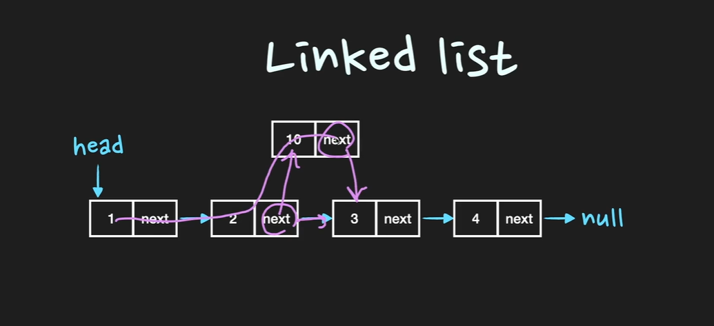
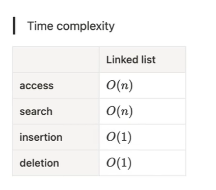

# DataStructure

해당 파일은 인프런의 `기출로 대비하는 개발자 전공면접`강의를 수강하며 정리한 글이며, 기존의 정리 글과는 차이가 존재합니다.

## Q. Array는 어떤 자료구조인가요?

Array는 **연관된 data**를 메모리상에 `연속적`이며 `순차적`으로 미리 할당된 크기만큼 저장하는 자료구조

> ✏ Tip
> 
> Array 관련 질문시에는 매우 높은 확률로 linked List에 대한 질문도 따라나온다.
> 이때 Array와 Linked List의 차이점을 중점으로 설명해야하며 가장 큰 차이점으로는 내부 API 사용시 시간복잡도 차이가존재한다.
> 배열의 경우 삽입 또는 삭제의 과정이 맨앞이나 맨뒤가 아닐경우 시간복잡도가 O(N)까지 늘어나지만 Linked List는 하나의 노드가 다음 노드의 정보를
> 가지고 있기에 시간복잡도가 O(1)로 나옴

### Array

- 배열은 저장이 될때 연속적으로 저장되며 중간에 빈자리가 생기지 않는다.
- 고정된 저장 공간을 가진다.

### Array의 Operation들의 time complexity

- 조회 : O(1) randomAccess
  - 주소값을 알고있기에 계산을통해 접근한다. 이를 RandomAccess라고한다.
- 마지막 인덱스에 추가/삭제 : O(1)
- 일반 삽입/삭제 : O(N)
  - 중간에 데이터를 삽입 또는 삭제할 경우 배열내부적으로 이동이 있어야함으로 N의 시간복잡도를 가짐
- 탐색 : O(N)
  - 일일히 탐색을 해야함으로 탐색하고자하는 대상에 따라 시간이 다르므로 N의 시간복잡도를 가진다.

Array의 장점으로는 조회가 빠르다는 점으로 조회가 빈번히 사용되는 작업에는 Array자료구조를 사용한다.
반면, 단점으로는 고정된 크기 특성상 미리 선언하여야하며, 메모리의 낭비나 추가적인 OverHead를 유발할 수 있다.

### Array (꼬꼬무문답) Q. 미리 예상한것보다 더많은 수의 data를 저장하느라 Array의 Size를 넘어서게 되었을 경우 어떻게 해결할 수 있을까요?

기존의 배열보다 더큰 Size의 Array를 선언하여 데이터를 옮겨 할당하고, 모든 데이터를 옮겼다면 기존 Array는 삭제합니다.
이렇게 동적으로 배열의 크기를 조절하는 자료구조를 Dynamic Array라고 합니다.
다른 방법으로는, Array대신 Linked List를 사용함으로서 데이터 추가시 새로운 메모리 공간을 할당받는 방법을 이용합니다.

*********************

## Q. Dynamic Array는 어떤 자료구조 인가요?

Array의 경우 Size가 고정되어 선언시 설정한 Size 이상의 데이터를 삽입할경우 저장 불가 또는 대체해야하는 단점이
존재하였습니다. 이를 반해 Dynamic Array는 저장공간이 가득차게 될 경우 resize를 이용하여 유동적으로 size를 조절하여 데이터를 저장하는 자료구조입니다.

> ✏ Tip
> Array의 특징중에 fixed-size의 한계점을 보안하고자 고안된 자료구조인 Dynamic Array
> 중점적으로 언급할 부분은 총두가지로 아래와같다.
> 
> `1.resize를 하는 방식`
>
> `2.데이터를 추가(append)할 때의 시간복잡도`

### Dyamic Array

- Dynamic Array는 정의적으로 size를 자동적으로 resizing을 하는 Array이다.
- 기존 고정된 size를 가진 Static Array의 한계점을 보완하고자 고안되었다.
- Dynamic Array는 data를 계속 추가하다가 기존 할당된 memory를 초과할 경우, size를 늘린 배열을 선언하고 그곳으로 모든 데이터를 이전하여 
최종적으로 기존의 size보다 큰 Array를 가지게되며 이를 `resize`라고 명명한다.
- Dynamic Array의 장점으로는 size가 고정적이지 않기에 이에대한 고려가 없다는 점이 존재한다.
- resizing을 하는방법으로는 `Array Doubling` 또는 `Amortized Analysis`가 존재한다.

### Array Doubling

resizing의 대표적인 방법으로 데이터를 추가(append O(1))하다가 메모리 초과시 기존 배열 size의 두배 크기의 배열을 선언한 후,
데이터를 일일이 옮기는 방법.

이때 데이터의 개수를 N이라고 가정하였을 때 모든 데이터를 옮겨야함으로 시간복잡도는 `O(N)`이 된다.

### 분활상환 시간복잡도 Amortized time complexity

Dynamic Array는 데이터를 추가할 때마다 시간복잡도는 O(1)이 소요된다.
그리고 resizing을 하기 위해선 미리 선언한 size를 넘어가는 순간 일일이 데이터를 모두 옮겨야하고 이때 결과적으로 O(N)의 시간이 걸린다.

**그렇다면 과연 데이터 삽입(append)의 시간복잡도는 O(1)이 맞는가?**

append의 총 과정을 살펴보자면 데이터를 마지막 인덱스에 추가하는 일반적인 작업(시간복잡도 O(1)을 가지는)이 대부분이고, size를 넘어설 때
doubling을 통해 옮기는 과정에서 (resize O(N))이 아주 가끔 발생한다. 
그렇기에 삽입의 시간복잡도는 O(1)이며 정확히는 `amortized O(1)`이라고 한다.

### Amortized Analysis

doubling 과정으로 인해 발생하는 시간복잡도 O(N)을 append operation 자체의 시간복잡도로 보기보다는 평균 연산을 고려하는 방법이다.

몇가지 특징으로는 아래와 같다.

- worst case를 분석한다.
- 연속해서 연산이 발생할 때,최악의 경우의 평균 연산을 고려한다.
- Average Analysis와의 차이점
  - Average Analysis의 경우 확률을 이용한 계산을 사용하지만, Amortized Analysis의 경우 최악의 경우의 평균을 사용한다.

#### Dynamic Array (꼬꼬무 문답) Q. Dynamic Array를 Linked List와 비교하여 장단점을 설명해 주세요.

Linked List와 비교했을 때, Dynamic Array의 **장점**은 다음과같다.

- Dynamic Array도 Array의 성질을 가지기에 데이터 접근 및 할당이 O(1)으로 굉장히 빠르다.
- Dynamic Array의 맨 뒤 데이터를 추가하거나 삭제하는 것 또한 Array의 특성이 있으므로 빠름

Linked List와 비교했을 때, Dynamic Array의 **단점**은 다음과같다.

- Dynamic Array의 맨끝이 아닌 곳에서 data를 insert or remove할 때 느리다.
  - 데이터의 수만큼 shift 해야하기에 시간복잡도 O(N)
- resize를 수행할 때 낮은 performance 발생
- resize에 시간이 많이 걸리고, memory 공간을 필요이상으로 할당받아 메모리 낭비 발생우려 

***********************

## Q. Linked List 대해서 설명해 주세요

Linked List는 Node라는 구조체로 이루어져 있는데, Node는 데이터 값과 다음 Node의 address를 저장한다.
Linked List는 물리적인 메모리상에서는 비연속적으로 저장되지만 Linked List를 구성하는 각각의 Node가  다음 Node의 address를 가리킴으로써 논리적인 연속성을 가진 자료구조이다.
단, 마지막 Node가 가리키는 address는 null값으로 저장되어있다.

> ✏ Tip
> 
> Linked List는 tree,graph등 다른 자료구조를 구현할 때 자주 쓰이는 기본 자료구조이다.
> 면접에서 Linked List를 설명할 때에는 메모리상에서 불연속적인 데이터가 저장된다는 점과 Node의 Next address를 통해 물리적으로 불연속적인 데이터를
> 논리적으로는 연속성을 보장해준다는 것을 위주로 설명한다.
> 또한, 데이터 추가 시점에 새로운 메모리를 할당하기에 메모리를 좀 더 효율적으로 사용할 수 있다.

### 논리적 연속성

각 Node는 다음 Node의 Address 즉, 주소를 알고있다. 그렇기에 논리적으로 연속성을 유지하며 연결되어 있다.
Array의 경우 연속성을 유지하기위해, 물리적 메모리상에서 순차적으로 저장하는 방법을 사용하였고, Linked List에서는 메모리의 연속성을 사용하지 않아도되는
제약의 자유로움이 생김으로서 메모리 사용의 부담이 표면적으로는 줄어들었지만, 다음 Node의 주소값을 새롭게 메모리에
할당해야하기에 데이터가 하나당 차지하는 메모리 사용량은 높아지게 되었습니다.

### Linked List의 삽입 삭제

위 그림과 같이 기존 Array에서 가지는 불편점인, Shift 과정없이 노드가 가리키는 주소값만 바꿔주면 삽입 및 삭제가 수월하다.

해당 과정을 거쳐 Array에서는 O(N)이던 시간복잡도를 주소값만 변경하는 것으로 바꾸어 O(1)의 시간복잡도만을 가진다.

위사진을 보면 access와 search는 빅오표기법으로 `O(N)`을 가진다. 이는 Array에서는 가능하던 random access라는 특성이 순차적 접근으로 바뀌어 N개의 데이터를
모두 접근해야한다는 특성으로 바뀌어 `O(N)`으로 표기된다.

********************

## ✨ Array vs Linked List를 비교해서 설명해주세요

Array는 메모리상에서 연속적으로 데이터를 저장하는 자료구조입니다. Linked List는 메모리 상에서는 연속적이지는 않지만, 각각의 원소가 다음원소의 주소값을
저장해놓기에 논리적으로는 연속성을 보장받는 자료구조입니다.

그래서 각 operation 즉 내부 동작 작업의 시간복잡도가 다릅니다. 데이터조회,접근은 Array의 경우 O(1) Linked List의 경우 O(N)이며 삽입/삭제 또한
Array는 O(N),Linked List는 O(1)의 시간복잡도를 가집니다.

따라서 데이터의 양이 고정적이고, 조회작업이 많다면 Array를, 데이터의 개수가 불확실하고 삽입 또는 삭제 작업이 잦다면 Linked List를 사용하는 것이 좋습니다.

`조회`에서는 Array는 random access라는 특성상 빠르지만, Linked List는 순차접근의 특성상 느리다.

`삽입/삭제`에서는 Array의 시간복잡도는 맨 앞/뒤의 경우 시간복잡도가 O(1)이며, 맨 마지막 원소가 아닌 중간에 있는 원소를 삽입/삭제 할경우
`shift`가 일어나기 때문에 비용이 추가적으로 지불된다.이경우에는 시간복잡도가 O(N)이다.

하지만 Linked List도 삽입후 정렬 단계를 거치기에 표면적으로는 시간복잡도가 O(1)이지만, 실질적으로는 O(N)이다.

### Memory

Array의 주된 장점은 데이터접근과 append(추가)가 빠르다는 것입니다. 하지만 잉여 메모리가 낭비된다는 단점이 존재합니다.
배열은 선언시에 fixed size를 설정하여 메모리 할당을 합니다. 즉, 데이터가 저장되어 있지 않더라도 메모리를 차지하는 잉여 메모리가 생긴다.

반면 Linked List는 runtime 중에서도 size의 조절이가능하며 필요한만큼 memory allocation을 진행하기에 메모리 낭비가 없습니다.

### (꼬꼬무 문답) Q. 어느상황에 Linked List를 쓰는게 Array보다 더 나을까요?

[핵심 답변]
- O(1)으로 삽입/삭제를 자주해야할 때,
- 얼마만큼의 데이터가 들어올지 예측할 수 없을 때
- 조회 작업이 별로 없을 때

### Q. 어느상황에 Array를 쓰는게 Linked List보다 더 나을 까요?

[핵심 답변]
- 조회 작업을 자주해야할 때
- Array를 선언할 당시에 데이터 갯수를 알고 있을 때
- 데이터를 반복문을 통해서 빠르게 순회할 때
- 메모리를 적게 쓰는게 중요한 상황일 때, Linked List보단 Array가 메모리를 적게 차지하기 때문에 미리 들어올 데이터의 양을 알고있다면 Array가 메모리를 더 효율적으로 사용함

### Q. Array와 Linked List의 memory allocation은 언제 일어나며, 메모리의 어느 영역을 할당 받나요?

- Array는 compile 단계에서 memory allocation이 일어납니다. 이를 static Memory Allocation이라고 하며, 이경우 Stack Memory 영역에 할당된다.

- Linked List의 경우 runtime에서 새로운 node가 추가될때 memory allocation이 일어나기에 Dynamic Memory Allocation이라고 하며, Heap 메모리 영역에 할당된다.

Array의 경우 fixed size로 이미 size를 알고 있기에 compile 단계에서 할당되고 Linked List의 경우 새로운 데이터 추가시 새로운 Node를 할당하기에 runtime에서 작동합니다.

***********************

## Q. Queue는 무슨 구조인가요?

queue는 선입선출 FIFO(First in First Out)의 자료구조입니다. 시간복잡도는 enqueue O(1),dequeue O(1)로, 활용 예시로는
Cache 구현, 프로세스 관리, 너비우선탐색(BFS)등이 존재합니다.

queue에 데이터를 offer하는 것을 `enqueue`라고 하며 반대로 poll하는 것을 `dequeue`라고한다. 또한 FIFO 구조임을 기억하자

### FIFO

선입선출의 원리로 먼저 넣은 데이터가 먼저 산출되는 자료구조이다.

### enqueue & dequeue

queue에서 데이터를 추가하는 것을 enqueue라고 하며, 반대로 추출하는 것을 dequeue라고 한다.

enqueue의 경우 queue의 맨 뒤에 데이터를 추가하면 되기에 시간복잡도는 O(1)이다.
이와 비슷하게 dequeue 역시 맨앞의 데이터를 삭제하면 되기에 시간복잡도는 O(1)이다.

### 구현방식

### Array-Base queue 
  
- enqueue와 dequeue 과정에서 남는 메모리가 생긴다.
- queue를 배열기반으로 제작하기 위해선 Front와 Rear가 존재해야한다.

### Array-Base queue에서의 enqueue
  
- 연산이 일어날 때 데이터가 Front와 Rear를 최우선적으로 가리키게 한다. 
- 두번째 부터 들어오는 데이터는 자연스럽게 꼬리(Rear)가 된다.

### Array-Base queue에서의 dequeue

- dequeue방법에는 총 두가지 방법이 존재한다.
  1. 단순히 데이터 추출시 다음 순서의 데이터를 앞으로 보내는 방식
  2. 데이터의 위치는 그대로 두며, Front를 움직이는 방식

- 하지만 첫번째 방법에는 문제점이 존재한다.
  - 첫번째로는 Front의 존재유무가 불분명해진다.
  - 두번째로는 dequeue 연산을 진행할 때마다,데이터를 이동시켜야하는 비용이 소모된다는 점이 존재한다.

- **그래서 두번째는 어떤가?**
  - 두번째 방식은 데이터는 그대로 두고 Front(맨앞)만 움직이는 방법이다. 즉, 가리키는 노드를 움직인다.
  - 하지만 해당방법도 문제는 존재한다. 배열의 상태가 아래 그림과 같을 경우 새로운 데이터를 enqueue할 시 Rear를 더 이상 이동시킬 수 없다.
  - 
  - 이 문제를 해결하기 위해서는 Rear을 맨 앞으로 이동시키면 된다.
    Rear이 배열의 끝에 도달하면 맨 앞으로 이동하고, Front 또한 Rear을 따라서 배열의 앞으로 이동하면 된다.
  - 이런 형태로 동작하는 배열 기반의 큐를 원형 큐(Circular queue)라고 한다.

### List-Based Queue

- 재할당이나 메모리 낭비의 걱정이 사라진다.
- Linked List 기반이기에 enqueue시에 메모리 새로할당 dequeue 시에 메모리 삭제

### 확장과 활용

queue의 개념에서 조금 확장한 자료구조들로는 양쪽에서 enqueue와 dequeue가 가능한 deque(덱,double-ended queue)와 시간순서가 아닌 우선쉰위가 높은순서로
dequeue할 수 있는 priority queue(우선순위 큐)가 있다.

활용 예시로는 하나의 자원을 공유하는 프린터나, CPU task scheduling, Cache 구현, 너비우선탐색(BFS)등이 있다.

### Circular Queue

원형큐라고 부르며 모습을 도식화하자면 다음과 같다.

데이터를 집어 넣는과정을 보자

처음 enqueue 과정에서는 front와 rear가 첫 데이터를 가리키게 된다. 이후 데이터가 추가될 수록 rear를 가리키는 포인터가 변한다.
dequeue 과정을 거칠 때는 Front가 이동하며 데이터를 꺼낸다.

하지만 여기서 문제점으로는, 데이터가 가득찼을 때와 모두 비워졌을 때이다.

그림과 같이 데이터가 가득찼을 때나, 비었을 때나 Front가 Rear를 앞선다.
여기서 문제는 Front와 Rear를 통해 큐의 상태를 알수 없다는 점이다.
이러한 문제를 해결하기 위해 다른방식을 사용한다.

그중가장 보편적인 방식이 배열을 꽉채우지 않고 사용하는 것이다.

그럼 이제 Front와 Rear의 상대적 위치를 통해 비어있는지 꽉 차 있는지를 구분한다.

### (꼬꼬무 문답) Q. Array-Base와 List-Base의 경우 어떤 차이가 존재하는가?

Array-Base의 경우 queue를 구현하기 위해 circular queue로 구현하는 것이 일반적입니다. 이는 메모리를 효율적으로 사용하기 위함이다.
또한 enqueue가 계속 발생할 경우 fixed size를 넘어서기 때문에, dynamic array와 같은 방법으로 Array의 size를 확장시켜야한다.
그럼에도 enqueue의 시간복잡도는 (amortized)O(1)을 유지할 수 있다.

List-Base의 경우 보통 singly-linked list로 구현합니다. enqueue는 단순히 singly-linked list에서 append를 하는 것으로 구현하고, 시간복잡도는 O(1)이며,
dequeue는 맨앞의 원소를 삭제하고 first head를 변경하면 되기 때문에 O(1)의 시간복잡도를 가진다.

요약하자면, 두 가지 종류의 자료구조로 queue를 구현하더라도 enqueue와 dequeue는 모두 O(1)의 시간복잡도를 갖는다.
Array-Base의 경우 전반적으로 performance가 더 좋지만, worst case의 경우에는 훨씬 느릴 수 있다.(resize)

List-Base의 경우 enqueue를 할때마다 memory allocation을 해야하기 때문에 전반적인 RUNTIME이 느릴 수 있습니다.